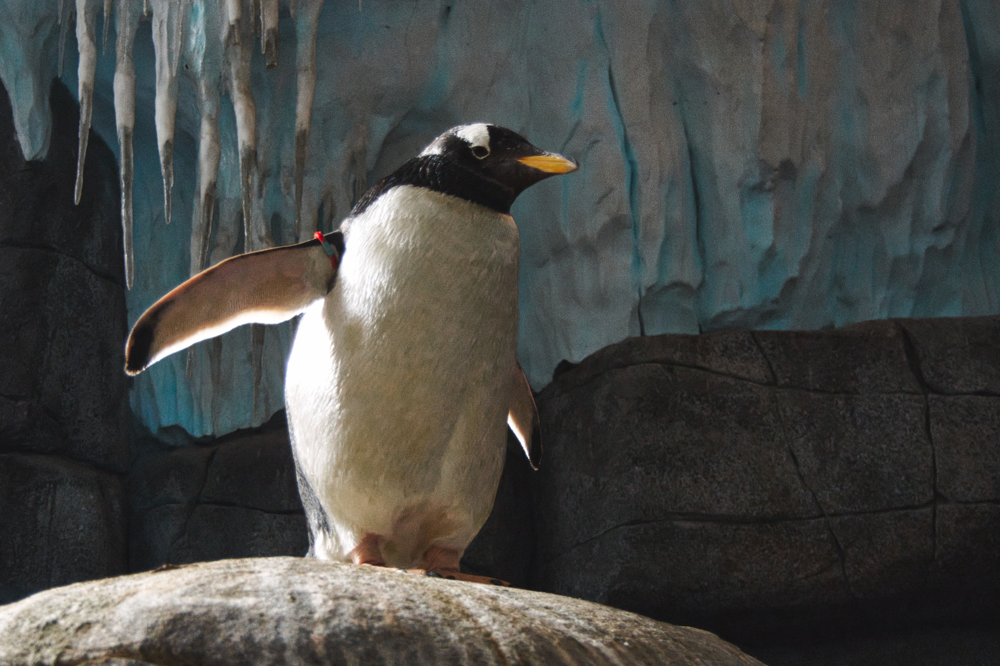

## authoring
i don't know yet what this will be for... 

# Github Flavoured Markdown

- ## external link
   -  https://help.github.com/en

- ## Images

[here is a link to the image folder](img/)

- ## Emojis
:metal:
:smile:
 
:hammer: :heart:

I have already eaten here this week:

| visited | restaurant |
|---------|:------------:|
| &#9745; |my kitchen |
| &#9744; |Kotti Dang |
| &#9744; |Olivio |
| &#9744; |Ammazza Che Pizza |
| &#9744; |Gazzo |
| &#9744; |GelGör |
| &#9744; |Duong Family |
| &#9744; |Burgers |
| &#9744; |Schleckerei |
